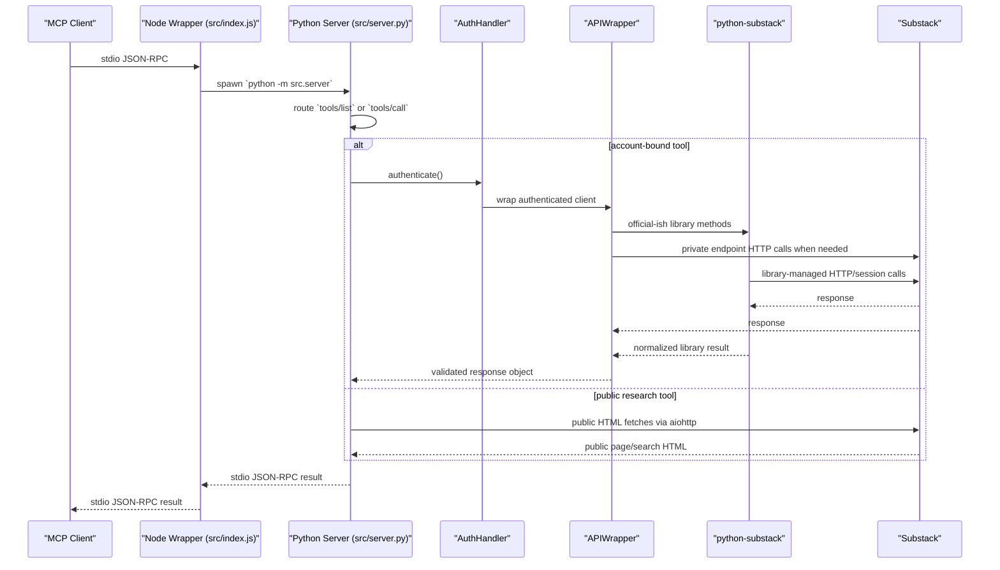

# Architecture

This repository ships a Node wrapper that starts the Python MCP server and forwards stdio traffic to it.

## Supported runtime path

- `src/index.js` is the shipped Node entrypoint.
- `src/server.py` is the only supported Python server entrypoint.
- `AuthHandler` owns cached authenticated clients and cookie-tempfile lifecycle.
- `APIWrapper` is the trust boundary around `python-substack` and private Substack responses.

## Notes

- `tools/list` works without account authentication.
- High-risk write tools use a two-step confirmation token flow enforced in `src/server.py`.
- Research tools fetch only public pages, identify themselves with a project User-Agent, rate-limit per host, and check `robots.txt`.
